# YanLin-Blog-Vue3

> 使用Vue3的前后端分离的个人博客
>
> [在线演示](https://www.yanlinn.com)
> 
> 后端API [地址](https://api.yanlinn.com)

## 主要技术构成

> Vue3全家桶
- [Vue Cli（Vue 脚手架工具）](https://cli.vuejs.org/zh/)
- [Vue（核心框架）](https://cn.vuejs.org/)
- [Vue Router（页面路由）](https://router.vuejs.org/zh/)
- [Vuex（状态管理）](https://vuex.vuejs.org/zh/)
- ES 6 / 7 （JavaScript 语言的下一代标准）
- Axios（网络请求）

## 使用
<details>
<summary>展开查看使用</summary>

## Project setup
```
npm install
```
### Compiles and hot-reloads for development
```
npm run serve
```
### Compiles and minifies for production
```
npm run build
```
### Lints and fixes files
```
npm run lint
```
### Customize configuration
See [Configuration Reference](https://cli.vuejs.org/config/).

</details>

## 目录
* [使用](#使用)
* [YanLin-Blog-Vue3](#YanLin-Blog-Vue3)
* [主要技术构成](#主要技术构成)
* [目录](#目录)
* [博客功能](#博客功能)
    * [页面](#页面)
    * [效果展示](#效果展示)
* [文件树](#文件树)
* [License](#License)

## 博客功能
### 页面
- Home                 主页
- News                 新闻页
- Biography            时间线页
- Download             下载页面
- Contsat              联系页面
- About                关于页面
- 404                  错误页面

### 效果展示
#### PC端
<details>
<summary>展开查看详细</summary>

主页<br>
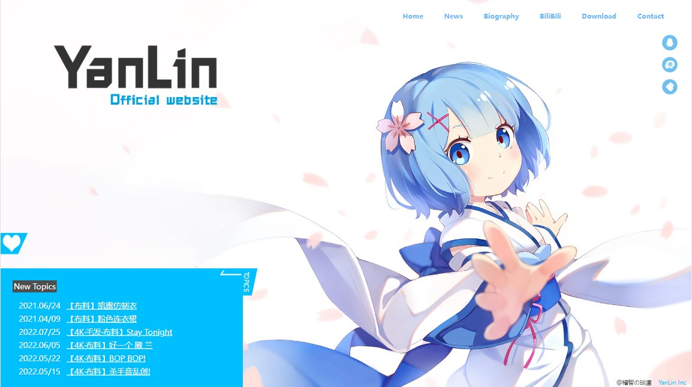

新闻页<br>
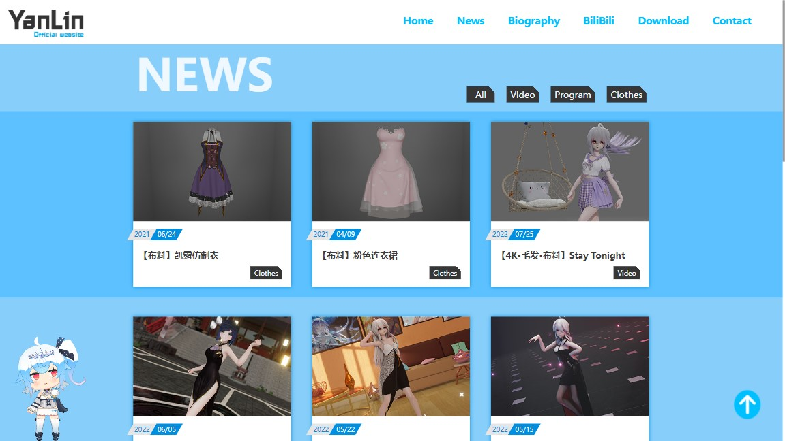

时间线<br>


下载页<br>
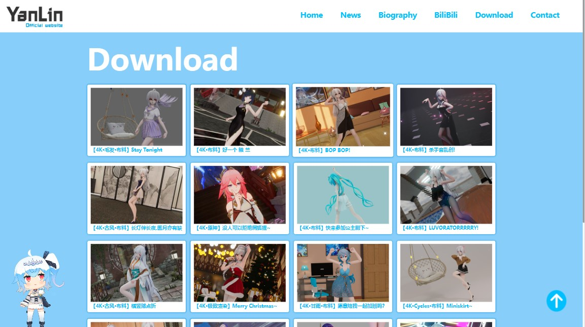

收集表单<br>
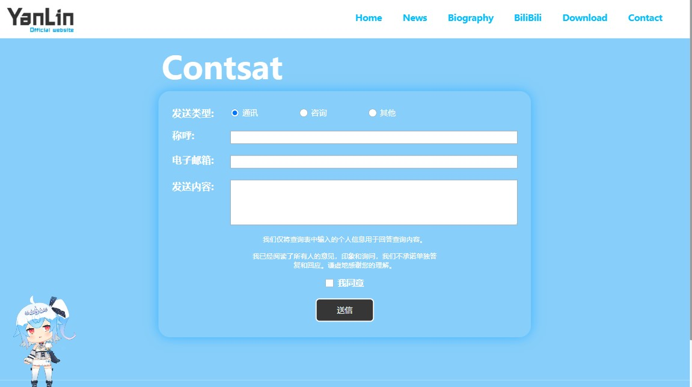

关于<br>
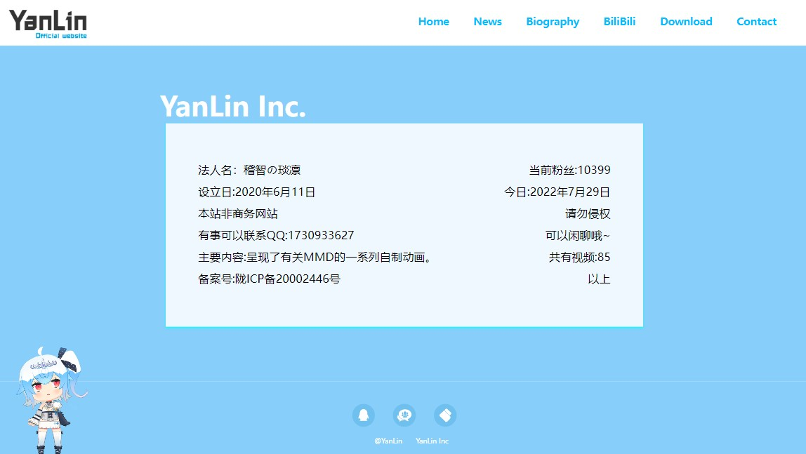

</details>

#### 移动端
<details>
<summary>展开查看详细</summary>

主页<br>
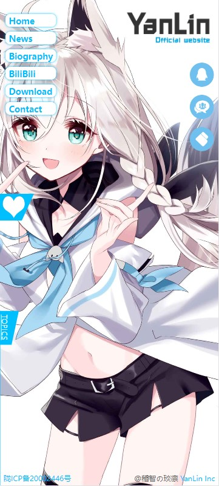

新闻页<br>
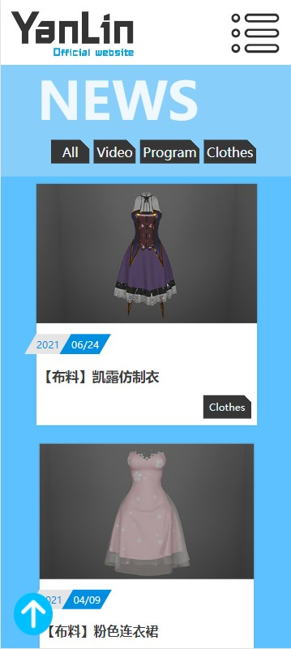

时间线<br>
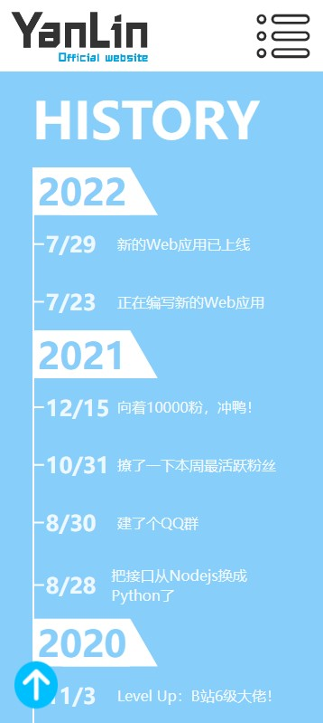

下载页<br>
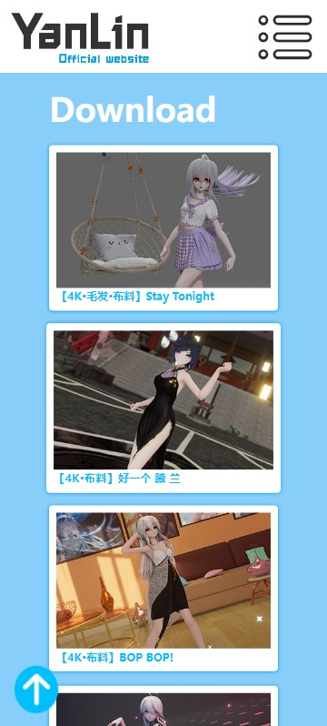

收集表单<br>
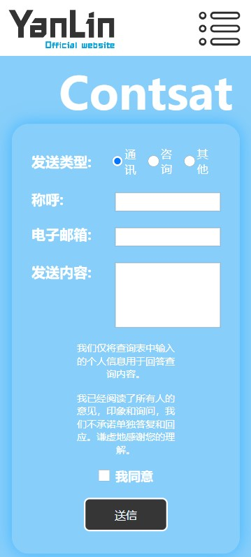

关于<br>
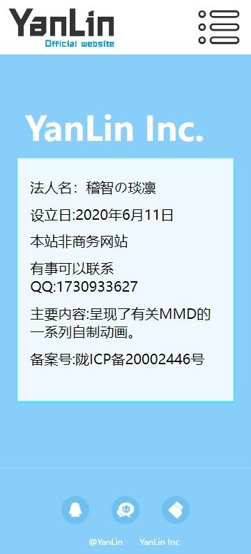

</details>

## 文件树
```
.
├─preview                               #预览图
│  ├─landscape
│  └─portrait
├─public                                #静态资源
│  ├─images
│  │  ├─background
│  │  │  └─article
│  │  └─icon
│  ├─img
│  │  └─封面
│  ├─live2d                             #live2D模型
│  │  └─bilibili-live
│  │     ├─22
│  │     └─33
│  └─style                              #某些静态样式
└─src                                   #主要代码目录
    │  App.vue
    │  main.js
    ├─assets
    │  ├─config
    │  │   ├─particlesjs-config.json    #粒子系统配置
    │  │   └─waifu-tips.json
    │  └─live2d
    ├─components                        #组件
    │  │  Live2D.vue                    #live2D的组件
    │  │  MyLogo.vue
    │  │  Particle.vue                  #粒子背景组件
    │  ├─About
    │  ├─Biography
    │  ├─Contact
    │  ├─Download
    │  ├─Home
    │  ├─News
    │  └─Subpage
    ├─pages                             #页面
    │  ├─About.vue
    │  ├─Biography.vue
    │  ├─Contact.vue
    │  ├─Download.vue
    │  ├─Home.vue
    │  ├─News.vue
    │  └─NotFound.vue
    ├─router                            #Vue-router
    │  └─index.js
    └─store                             #Vuex
       ├─heardStatus.js
       ├─index.js
       ├─videoInfo.js
       └─windowSize.js
```

## License

[Yan_Lin](https://github.com/1730933627/Blog-Vue3/blob/master/README.md)
